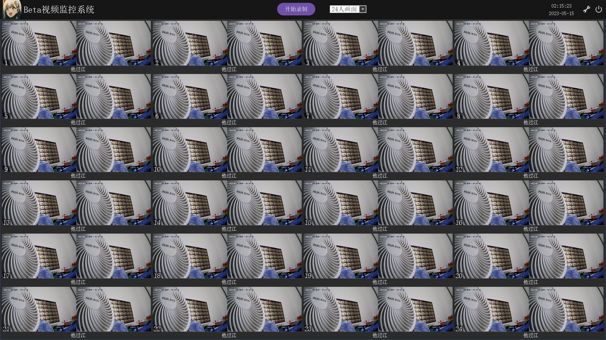
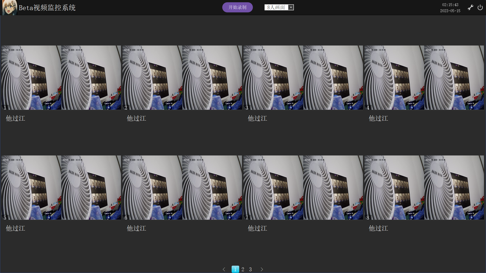
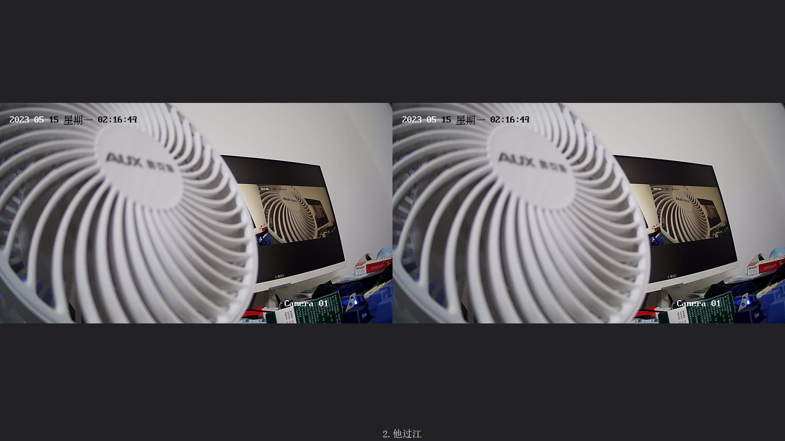

# 基于Qt+FFmpeg的视频监控系统

## 需求分析
假设一个业务场景：每个员工工位旁有两个网络摄像头。老板需要一个员工监控软件，在上班时软件可以拉取RTSP视频流，也可以随时录制视频。这样老板就可以知道谁在摸鱼了 ◕‿◕  
为防有人上纲上线，在此特别声明：上面的场景是开玩笑的。监控软件有很多使用场景：学校，公安，交通，考试，零售等等。

## 功能
* 支持画面按人数分页（8/12/24/28），默认24人画面  
* 支持单人切换大屏（鼠标右键）  
* 可同时播放和录制48路视频  

## UI
单页24人

3页，每页8人

单人大屏

## 技术选型
* 界面实现用Qt  
* 拉流解码播放用FFmpeg  

## 环境依赖
### windows
VS：推荐VS2019以后的版本  
Qt：推荐Qt5.12以后的版本  
FFmpeg-4.3.1（项目已包含，生成项目后dll会自动拷贝到bin目录）
  
解决方案仅支持64位的Debug/Release，32位可自行适配

## TODO
- [ ] GPU解码和渲染

